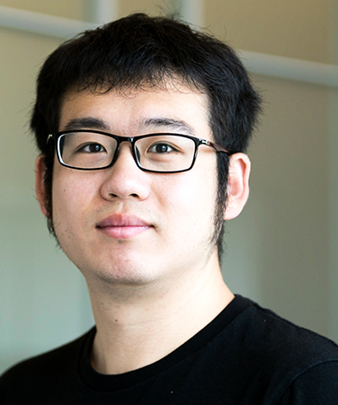

<table border="0">
 <tr>
    <td> 
     <b style="font-size:30px">DR. AMÉDÉE DES GEORGES</b> 
       <b style="font-size:20px">Title:</b> 
Assistant Professor of Chemistry, ASRC Structural Biology Initiative 
Assistant Professor of Chemistry & Biochemistry, City College of New York 
     <b style="font-size:20px">Contact:</b> amedee.desgeorges@asrc.cuny.edu | 212-413-3232 
     Amédée des Georges, Ph.D. is a structural biologist with particular expertise in single-particle cryo-electron microscopy. He uses the ability of single-particle cryo-electron microscopy to sort electron microscopy images into different sub-populations in order to obtain high resolution structures of samples conformationally or compositionally heterogeneous, such as the mammalian translation initiation complex or the largest known membrane channel called the ryanodine receptor. He established a research group exploring with cryo-electron microscopy the regulatory mechanisms of such large protein and RNA complexes.

Des Georges received his B.S. and M.S. in Biochemistry from Université Pierre and Marie Curie in Paris before obtaining his Ph.D. degree from the University of Cambridge in 2008 for his work with Linda Amos at the MRC-Laboratory of Molecular Biology. He then joined the lab of Joachim Frank at Columbia University as a postdoctoral researcher. In addition of being a core faculty member of the ASRC Structural Biology Initiative, des Georges is a tenure-track assistant professor at the City College Department of Chemistry and Biochemistry.

Des Georges was appointed to the ASRC in August 2015. 

<b style="font-size:20px">RESEARCH INTERESTS</b>
Structural and functional study of the regulation of large macromolecular complexes using cryo-electron microscopy.
</td>
    
 </tr>
 <tr>
    <td></b>
    <b style="font-size:30px">DA CUI</b>  
<b style="font-size:30px">Title/Position:</b>  Ph.D. Student, Amédée des Georges Lab</b> 
<b style="font-size:30px">Contact:</b>Da.Cui@asrc.cuny.edu</b> 
Motivated and inspired by resolution revolution of cryo-EM, I joined des Georges' lab to study eukaryotic translation initiation, a highly-regulated and dynamic system. My short-term goal during PhD study is to train myself to be an independent researcher, while at the same time, to study structural basis of canonical eukaryotic translation initiation. I want to provide insights towards how 43S is formed and how 43S scans along mRNA to promote codon recognition. My long-term goal is to start my own lab in a research institute, continuing to study the structural basis of central dogma using biophysical and biochemical tools. More importantly, I hope to train future PhD students into independent researcher of the next generation, just like what I'm doing right now.
 </td>
    <td>Lorem ipsum ...</td>
 </tr>
</table>
