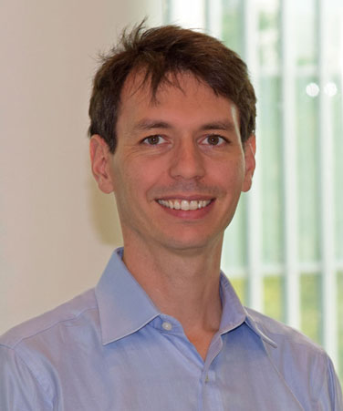
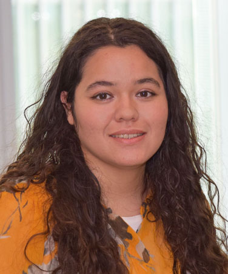
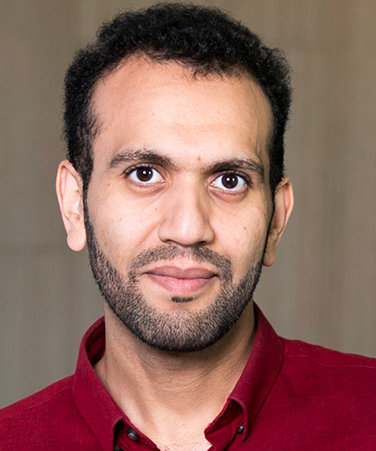
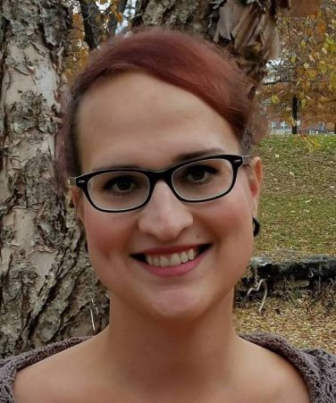
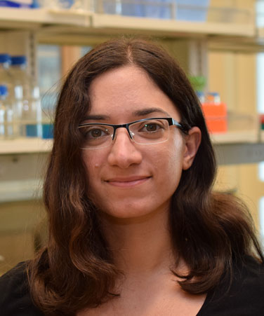

| | | |
|-|-|-|
|**DR. AMÉDÉE DES GEORGES** **Position**  Assistant Professor of Chemistry, ASRC Structural Biology Initiative  Assistant Professor of Chemistry Biochemistry, City College of New York  **Contact** amedee.desgeorges@asrc.cuny.edu (212-413-3232) **RESEARCH INTERESTS**  Structural and functional study of the regulation of large macromolecular complexes using cryo-electron microscopy| Amédée des Georges, Ph.D. is a structural biologist with particular expertise in single-particle cryo-electron microscopy. He uses the ability of single-particle cryo-electron microscopy to sort electron microscopy images into different sub-populations in order to obtain high resolution structures of samples conformationally or compositionally heterogeneous, such as the mammalian translation initiation complex or the largest known membrane channel called the ryanodine receptor. He established a research group exploring with cryo-electron microscopy the regulatory mechanisms of such large protein and RNA complexes. Des Georges received his B.S. and M.S. in Biochemistry from Université Pierre and Marie Curie in Paris before obtaining his Ph.D. degree from the University of Cambridge in 2008 for his work with Linda Amos at the MRC-Laboratory of Molecular Biology. He then joined the lab of Joachim Frank at Columbia University as a postdoctoral researcher. In addition of being a core faculty member of the ASRC Structural Biology Initiative, des Georges is a tenure-track assistant professor at the City College Department of Chemistry and Biochemistry. Des Georges was appointed to the ASRC in August 2015 |
| Normal Key | Value2 |

------

## 

  
**DA CUI**

**Position** 
Ph.D. Student, Amédée des Georges Lab  
**Contact**  
dominique.gutierrez@asrc.cuny.edu  

Motivated and inspired by resolution revolution of cryo-EM, I joined des Georges' lab to study eukaryotic translation initiation, a highly-regulated and dynamic system. My short-term goal during PhD study is to train myself to be an independent researcher, while at the same time, to study structural basis of canonical eukaryotic translation initiation. I want to provide insights towards how 43S is formed and how 43S scans along mRNA to promote codon recognition. My long-term goal is to start my own lab in a research institute, continuing to study the structural basis of central dogma using biophysical and biochemical tools. More importantly, I hope to train future PhD students into independent researcher of the next generation, just like what I'm doing right now.

------

  
**DOMINIQUE GUTIERREZ**

**Position** 
Ph.D. Student, Amédée des Georges Lab  
**Contact**  
Da.Cui@asrc.cuny.edu  
Dominique Gutierrez graduated from the University of Texas at El Paso (UTEP) with a B.S. in Cellular and Molecular Biochemistry in 2016 receiving high honors and the College of Science Award for Academic and Research Excellence. Dominique’s undergraduate research experiences led her to seek a PhD position in the structural biology lab of Amedee des Georges where she could develop her interest in studying molecular effects at an atomic level.

Outside of the lab Dominique enjoys exploring the city, anything music related, and keeping up with the broader scientific literature.

**RESEARCH INTERESTS**  
Exploring the mechanistic interplay of macromolecular complexes such as those involved in translation initiation using biophysical methods such as cryo-electron microscopy and tomography.

------

  
**SALAH SALAH**

**Position** 
Ph.D. Student, Amédée des Georges Lab  
**Contact**  
Salah.Salah@asrc.cuny.edu  

I joined the PhD program for the benefits of the highly independent atmosphere it offers: continually rewarding small, patient, semi-obsessive steps forward with confident leaps in the advancement of our understanding. My passion for science is birthed from the same sense that values creativity and imagination. Too many of my thoughts revolve around the fractal behaviour of biology, and I take a special pleasure in finding correlations between certain principles of biology and other abstractions from different disciplines, especially the boundary problem in physics. I believe biology lives on the boundary of reality, which in turn gives life the ability to adapt and move in time. Long term, I hope to contribute to the community that uncovers common ground between biology and artificial intelligence. My current projects concentrate on analysing cryo-EM data of proteins and their dynamic motions. To view a history of all the projects I have contributed to, visit my github account here. [GitHub](https://github.com/SalahBioPhysics)

------

  
**DR. TARA MARCINK**

**Position** 
Postdoctoral Researcher, Amédée des Georges Lab  
**Contact**  
tara.marcink@asrc.cuny.edu  

My drive is to use cryo-electron tomography as a way to  understand protein-protein interactions on membrane surfaces in near cellular conditions. Currently, my research is focused on identifying mechanisms of fusion at the viral-host surface. In the future I am interested in other viral-host membrane interactions including fusion with a host membrane, protein packaging, and viral budding. These studies align with my general research interests of structural biochemistry, lipidomics, molecular dynamics, and virus-host interactions.

------

**Fahmeed Sheehan**

**Position** 
Doctoral Student, Amédée des Georges Lab  
**Contact**  
fsheehan@gradcenter.cuny.edu  
My drive for doing research is to answer fundamental questions about chemical interactions, specifically in the short peptide realm. While it is widely understood that short peptide sequences interact with each other to form supramolecular nano-structures, unique structural features for many such systems have not been identified. My goal in the des Georges lab is to use cryo-electron microscopy to figure out how peptides that form gels self-assemble.

------

## FORMER MEMBERS

  
**DR. DANYA BEN-HAIL**

**Position** 
Postdoctoral Researcher, Amédée des Georges Lab  
**Contact**  
danya.ben-hail@asrc.cuny.edu  
My passion is to tackle complex questions and problems by breaking them down to clear manageable aims.
My previous research experience includes molecular biology, biochemistry and electrophysiology while working in collaboration with people from around the world. Wishing to continue in this vein and challenge myself, I joined the des Georges lab to learn new advanced methods and form new collaborations. 

------

