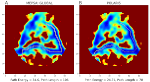
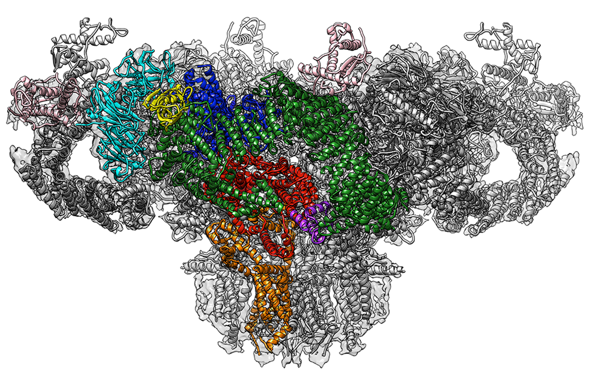

  

   **DR. AMÉDÉE DES GEORGES** **Position**  Assistant Professor of Chemistry, ASRC Structural Biology Initiative  Assistant Professor of Chemistry Biochemistry, City College of New York  **Contact** amedee.desgeorges@asrc.cuny.edu (212-413-3232) **RESEARCH INTERESTS**  Structural and functional study of the regulation of large macromolecular complexes using cryo-electron microscopy
  

  

   Amédée des Georges, Ph.D. is a structural biologist with particular expertise in single-particle cryo-electron microscopy. He uses the ability of single-particle cryo-electron microscopy to sort electron microscopy images into different sub-populations in order to obtain high resolution structures of samples conformationally or compositionally heterogeneous, such as the mammalian translation initiation complex or the largest known membrane channel called the ryanodine receptor. He established a research group exploring with cryo-electron microscopy the regulatory mechanisms of such large protein and RNA complexes. Des Georges received his B.S. and M.S. in Biochemistry from Université Pierre and Marie Curie in Paris before obtaining his Ph.D. degree from the University of Cambridge in 2008 for his work with Linda Amos at the MRC-Laboratory of Molecular Biology. He then joined the lab of Joachim Frank at Columbia University as a postdoctoral researcher. In addition of being a core faculty member of the ASRC Structural Biology Initiative, des Georges is a tenure-track assistant professor at the City College Department of Chemistry and Biochemistry. Des Georges was appointed to the ASRC in August 2015 
  

  

    
  

  

    A. Dashti, D.B. Hail, G. Mashayekhi, P. Schwander, A. des Georges, J. Frank, A. Ourmazd (co-corresponding author) (2018) Functional Pathways of Biomolecules Retrieved from Single-particle Snapshots. bioRxiv: 291922 (pre-print)
  

  

  

  

  

  

  

  

  

  

  

  

  

  

  

  

  

  

  

  

  

  

  

  

  

  

  

  

  

  

  

  

  

  

  

  

  

- Montemiglio, L. C., Testi, C., Ceci, P., Falvo, E., Pitea, M., Savino, C., Arcovito, A., Peruzzi, G., Baiocco, P., Mancia, F., Boffi, A., des Georges, A., … Vallone, B. (2019). Cryo-EM structure of the human ferritin-transferrin receptor 1 complex. Nature communications, 10(1), 1121. doi:10.1038/s41467-019-09098-w

- Chase, J., Catalano, A., Noble, A. J., Eng, E. T., Olinares, P. D., Molloy, K., Pakotiprapha, D., Samuels, M., Chait, B., des Georges, A., … Jeruzalmi, D. (2018). Mechanisms of opening and closing of the bacterial replicative helicase. eLife, 7, e41140. doi:10.7554/eLife.41140

- Iketani, S., Shean, R. C., Ferren, M., Makhsous, N., Aquino, D. B., des Georges, A., Rima, B., Mathieu, C., Porotto, M., Moscona, A., … Greninger, A. L. (2018). Viral Entry Properties Required for Fitness in Humans Are Lost through Rapid Genomic Change during Viral Isolation. mBio, 9(4), e00898-18. doi:10.1128/mBio.00898-18

- Noble, A. J., Dandey, V. P., Wei, H., Brasch, J., Chase, J., Acharya, P., Tan, Y. Z., Zhang, Z., Kim, L. Y., Scapin, G., Rapp, M., Eng, E. T., Rice, W. J., Cheng, A., Negro, C. J., Shapiro, L., Kwong, P. D., Jeruzalmi, D., des Georges, A., Potter, C. S., … Carragher, B. (2018). Routine single particle CryoEM sample and grid characterization by tomography. eLife, 7, e34257. doi:10.7554/eLife.34257

- Calisti, L., Trabuco, M. C., Boffi, A., Testi, C., Montemiglio, L. C., des Georges, A., Benni, I., Ilari, A., Taciak, B., Białasek, M., Rygiel, T., Król, M., Baiocco, P., … Bonamore, A. (2018). Engineered ferritin for lanthanide binding. PloS one, 13(8), e0201859. doi:10.1371/journal.pone.0201859

- Santulli, G., Lewis, D., des Georges, A., Marks, A. R., & Frank, J. (2018). Ryanodine Receptor Structure and Function in Health and Disease. Sub-cellular biochemistry, 87, 329-352

- des Georges, A., Clarke, O. B., Zalk, R., Yuan, Q., Condon, K. J., Grassucci, R. A., Hendrickson, W. A., Marks, A. R., … Frank, J. (2016). Structural Basis for Gating and Activation of RyR1. Cell, 167(1), 145-157.e17

- des Georges, A., Dhote, V., Kuhn, L., Hellen, C. U., Pestova, T. V., Frank, J., & Hashem, Y. (2015). Structure of mammalian eIF3 in the context of the 43S preinitiation complex. Nature, 525(7570), 491-5

- Zalk, R., Clarke, O. B., des Georges, A., Grassucci, R. A., Reiken, S., Mancia, F., Hendrickson, W. A., Frank, J., … Marks, A. R. (2014). Structure of a mammalian ryanodine receptor. Nature, 517(7532), 44-9
